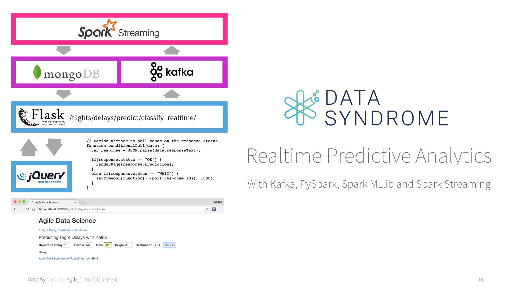
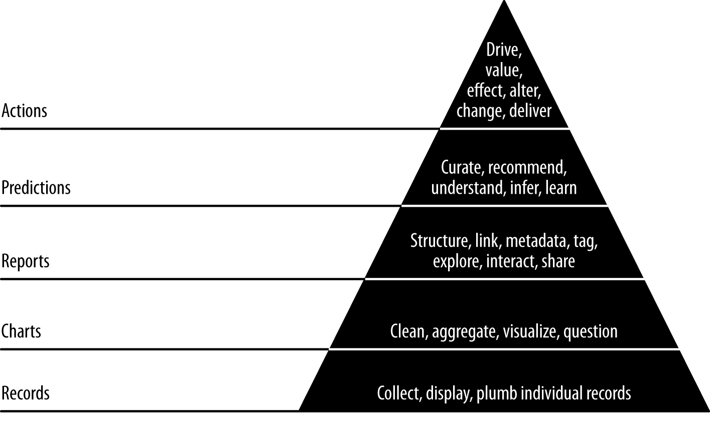
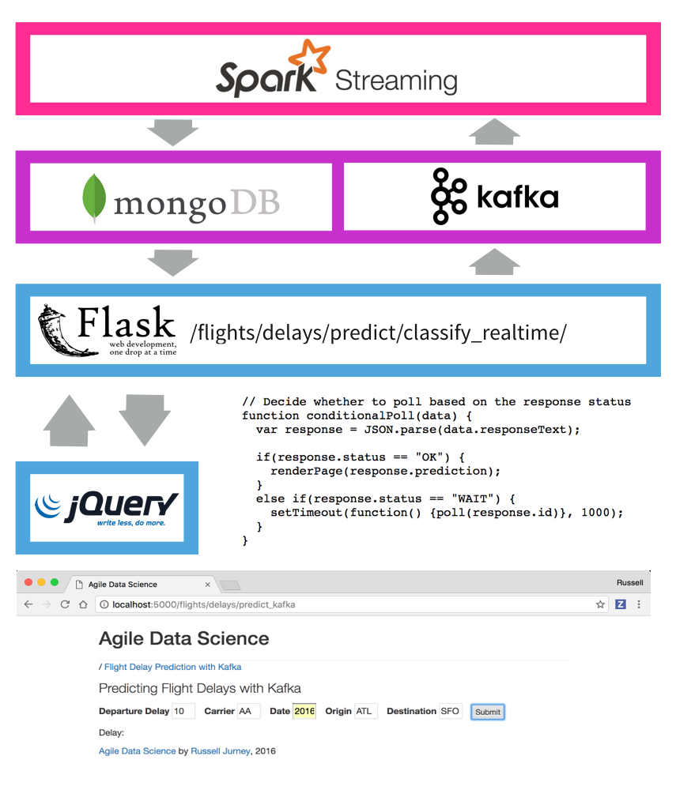
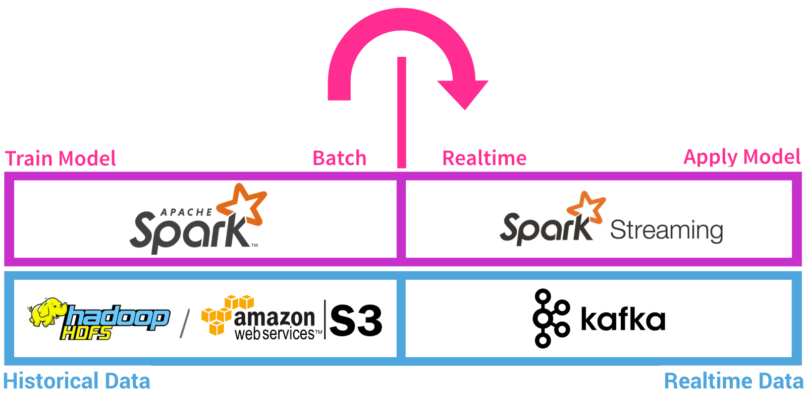
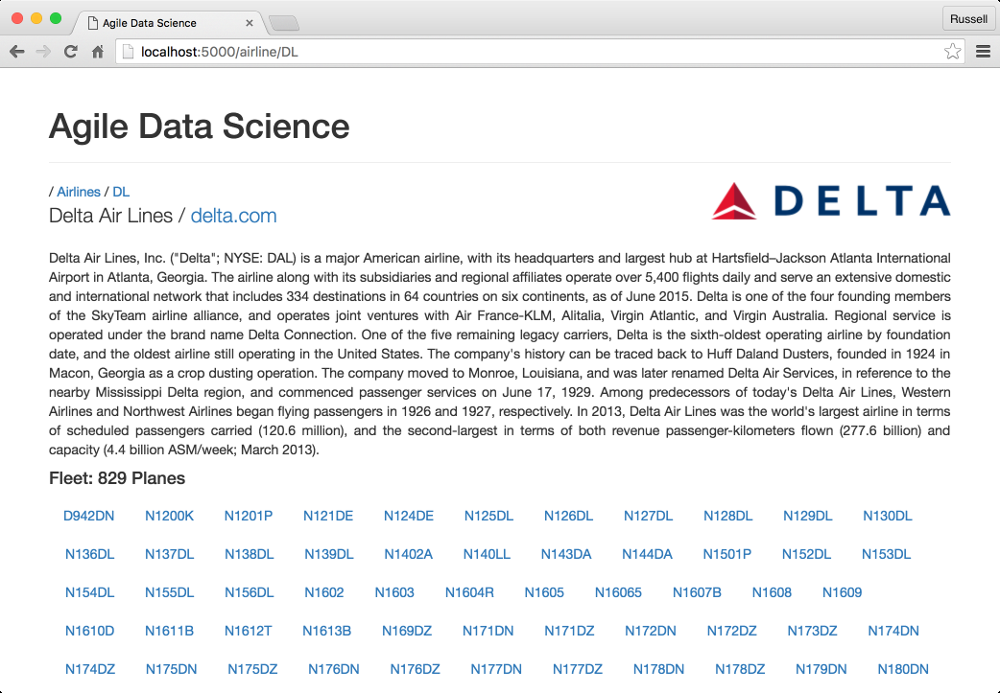
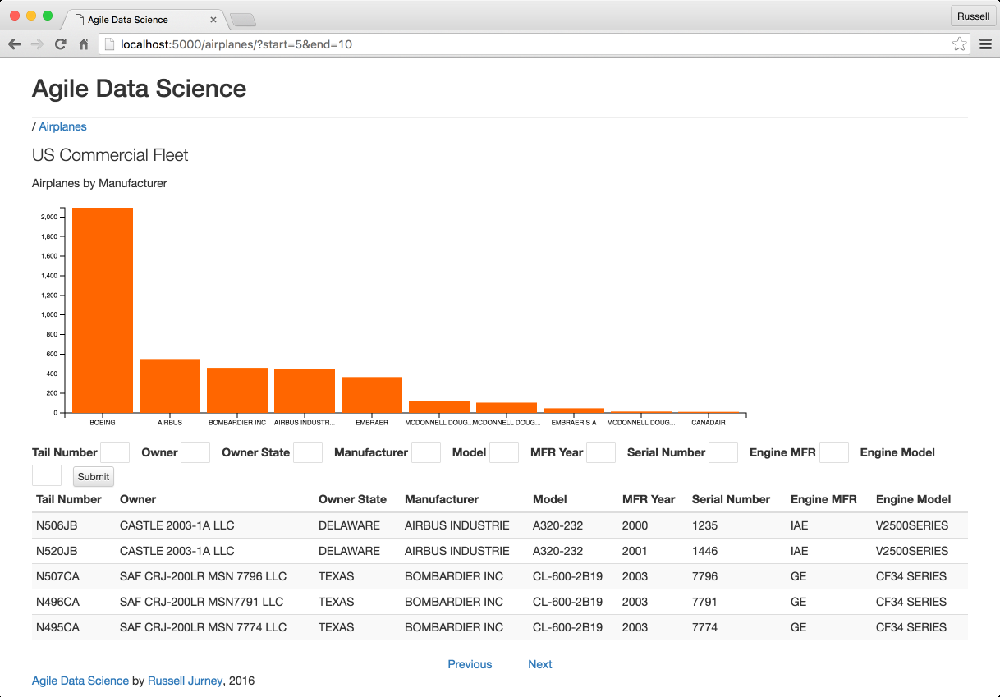
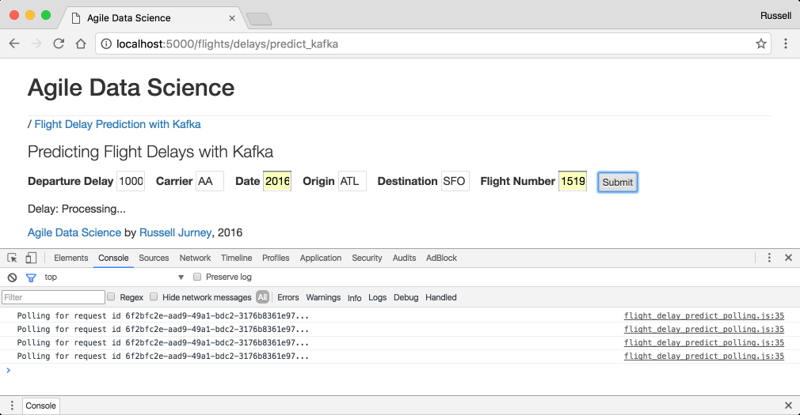

# Agile_Data_Code_2

Code for [Agile Data Science 2.0](http://shop.oreilly.com/product/0636920051619.do), O'Reilly 2017. Now available at the [O'Reilly Store](http://shop.oreilly.com/product/0636920051619.do), on [Amazon](https://www.amazon.com/Agile-Data-Science-2-0-Applications/dp/1491960116) (in Paperback and Kindle) and on [O'Reilly Safari](https://www.safaribooksonline.com/library/view/agile-data-science/9781491960103/). Also available anywhere technical books are sold!

This is also the code for the [Realtime Predictive Analytics](http://datasyndrome.com/video) video course and [Introduction to PySpark](http://datasyndrome.com/training) live course!

Have problems? Please file an issue!

## Data Syndrome

Like my work? I am Principal Consultant at [Data Syndrome](http://datasyndrome.com), a consultancy offering assistance and training with building full-stack analytics products, applications and systems. Find us on the web at [datasyndrome.com](http://datasyndrome.com).


## Realtime Predictive Analytics Course

There is now a video course using code from chapter 8, [Realtime Predictive Analytics with Kafka, PySpark, Spark MLlib and Spark Streaming](http://datasyndrome.com/video). Check it out now at [datasyndrome.com/video](http://datasyndrome.com/video).

A free preview of the course is available at [https://vimeo.com/202336113](https://vimeo.com/202336113)

[](http://datasyndrome.com/video)

## Installation

There are two methods of installation: Vagrant/Virtualbox or Amazon EC2.

### Amazon EC2

Amazon EC2 is the preferred environment for this book/course, because it is simple and painless. Installation takes just a few moments using Amazon EC2. 

First you will need to install the Amazon CLI via:

```
pip install awscli
```

Now you must authenticate into the AWS CLI via:

```
aws configure
```

Once you've provided it your AWS credentials, run the following command to bring up a machine pre-configured with the book's complete environment and source code:

```
./ec2.sh
```

#### How it Works

The script [ec2.sh](ec2.sh) uses the file [aws/ec2_bootstrap.sh](aws/ec2_bootstrap.sh) as `--user-data` to boot a single r3.xlarge EC2 instance in the us-east-1 region with all dependencies installed and running. 

In addition, it uses the AWS CLI to create a key-pair called `agile_data_science` (which then appears in this directory under [agile_data_science.pem](agile_data_science.pem)). It also creates a security group called `agile_data_science` with port 22 open only to your external IP address.

Note: this script uses the utility [`jq`](https://stedolan.github.io/jq/) to parse the JSON returned by the AWS CLI. The script will detect whether `jq` is installed and will attempt to use the script [jq_install.sh](jq_install.sh) to install it locally if it is not present. If the install fails, you will be instructed to install it yourself.

#### Next Steps

When it succeeds, the ec2 script will print instructions on what to do next: how to ssh into the ec2 instance, and how to create an ssh tunnel to forward web applications run on the ec2 instance to your local port 5000 where you can view them at [http://localhost:5000](http://localhost:5000).

The script to create an ssh tunnel is [ec2_create_tunnel.sh](ec2_create_tunnel.sh).

Now jump ahead to "Downloading Data".

### Vagrant/Virtualbox Install

Installation takes a few minutes, using Vagrant and Virtualbox. 

**Note: Vagrant/Virtualbox method requires 9GB free RAM, which will mean closing most programs on a 16GB Macbook Pro. If you don't close most everything, you will run out of RAM and your system will crash. Use the EC2 method if this is a problem for you.**

```
vagrant up
vagrant ssh
```

Now jump ahead to Downloading Data.

### Manual Install

For a manual install read Appendix A for further setup instructions. Checkout [manual_install.sh](manual_install.sh) if you want to install the tools yourself and run the example code. 

Note: You must READ THE MANUAL INSTALL SCRIPT BEFORE RUNNING IT. It does things to your `~/.bash_profile` that you should know about. Again, this is not recommended for beginners.

Note: You must have Java installed on your computer for these instructions to work. You can find more information about how to install Java here: [https://www.java.com/en/download/help/download_options.xml](https://www.java.com/en/download/help/download_options.xml)

## Downloading Data

Once the server comes up, download the data and you are ready to go. First change directory into the `Agile_Data_Code_2` directory.

```
cd Agile_Data_Code_2
```
Now download the data, depending on which activity this is for.

For the book Agile Data Science 2.0, run: 

```
./download.sh
```

For the [Introduction to PySpark](http://datasyndrome.com/training) course, run:

```
./intro_download.sh
```

For the [Realtime Predictive Analytics](http://datasyndrome.com/video) video course, or to skip ahead to chapter 8 in the book, run: 

```
ch08/download_data.sh
```

## Running Examples

All scripts run from the base directory, except the web app which runs in ex. `ch08/web/`.

### Jupyter Notebooks

All notebooks assume you have run the jupyter notebook command from the project root directory `Agile_Data_Code_2`. If you are using a virtual machine image (Vagrant/Virtualbox or EC2), jupyter notebook is already running. See directions on port mapping to proceed.

# The Data Value Pyramid

Originally by Pete Warden, the data value pyramid is how the book is organized and structured. We climb it as we go forward each chapter.



# System Architecture

The following diagrams are pulled from the book, and express the basic concepts in the system architecture. The front and back end architectures work together to make a complete predictive system.

## Front End Architecture

This diagram shows how the front end architecture works in our flight delay prediction application. The user fills out a form with some basic information in a form on a web page, which is submitted to the server. The server fills out some neccesary fields derived from those in the form like "day of year" and emits a Kafka message containing a prediction request. Spark Streaming is listening on a Kafka queue for these requests, and makes the prediction, storing the result in MongoDB. Meanwhile, the client has received a UUID in the form's response, and has been polling another endpoint every second. Once the data is available in Mongo, the client's next request picks it up. Finally, the client displays the result of the prediction to the user! 

This setup is extremely fun to setup, operate and watch. Check out chapters 7 and 8 for more information!



## Back End Architecture

The back end architecture diagram shows how we train a classifier model using historical data (all flights from 2015) on disk (HDFS or Amazon S3, etc.) to predict flight delays in batch in Spark. We save the model to disk when it is ready. Next, we launch Zookeeper and a Kafka queue. We use Spark Streaming to load the classifier model, and then listen for prediction requests in a Kafka queue. When a prediction request arrives, Spark Streaming makes the prediction, storing the result in MongoDB where the web application can pick it up.

This architecture is extremely powerful, and it is a huge benefit that we get to use the same code in batch and in realtime with PySpark Streaming.



# Screenshots

Below are some examples of parts of the application we build in this book and in this repo. Check out the book for more!

## Airline Entity Page

Each airline gets its own entity page, complete with a summary of its fleet and a description pulled from Wikipedia.



## Airplane Fleet Page

We demonstrate summarizing an entity with an airplane fleet page which describes the entire fleet.



## Flight Delay Prediction UI

We create an entire realtime predictive system with a web front-end to submit prediction requests.


